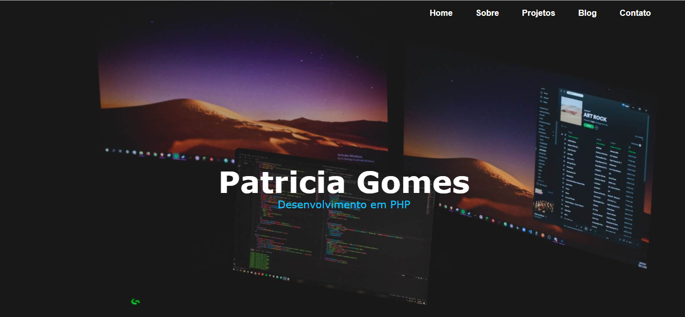

# Portfólio

O frontend do meu portfólio desenvolvido com Flexbox, HTML5 e Javascript.

O que aprendi nesse projeto:

<ul>
	<li>Menu mobile utilizando arrow functions. E âncora com Javascript</li>
	<li>Personalizar a scroll bar</li>
	<li>Responsividade com Flexbox</li>
</ul>

